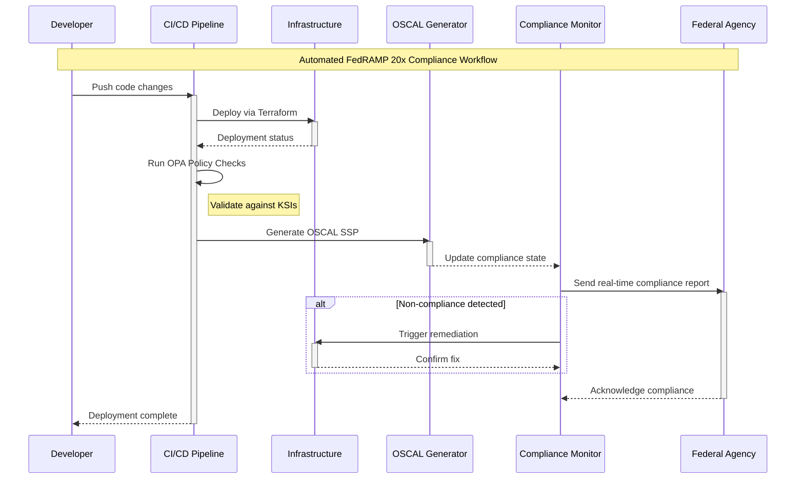

FedRAMP 20x introduces a revolutionary shift in technical implementation, moving from manual documentation to automated, machine-readable compliance workflows. The implementation centers around three primary pillars: automation of security controls, OSCAL integration for machine-readable documentation, and real-time continuous monitoring.

###  Core Technical Components

1. **Automation Framework**  - Infrastructure as Code (IaC) tools for automated deployment and validation
  - Policy-as-Code engines for continuous security policy enforcement
  - Automated vulnerability scanning and compliance validation


2. **OSCAL Integration**  - Machine-readable System Security Plans (SSPs)
  - Dynamic documentation updates through automation
  - Programmatic ATO package generation and validation


3. **Real-Time Monitoring**  - Cloud API integrations for continuous data collection
  - Automated compliance dashboards
  - Self-healing infrastructure capabilities





The diagram above illustrates the automated compliance workflow in FedRAMP 20x, where:

- Developers trigger the process by pushing code changes
- The CI/CD pipeline orchestrates both deployment and compliance checks
- Infrastructure changes automatically generate updated OSCAL documentation
- Real-time monitoring enables immediate remediation of compliance issues
- Federal agencies receive automated compliance reports

###  Technical Implementation Details

####  1. Automation Infrastructure

```yaml
# Example Terraform Policy Definition
resource "aws_iam_policy" "fedramp_compliance" {
  name        = "FedRAMP-Compliance-Policy"
  description = "Automated FedRAMP compliance controls"

  policy      = jsonencode({
    Version = "2012-10-17"
    Statement = [
      {
        Effect = "Deny"
        Action = [
          "s3:*",
        ]
        Resource = "*"
        Condition = {
          StringNotEqualsIgnoreCase = {
            "s3:x-amz-server-side-encryption" = "AES256"
          }
        }
      },
    ]
  })
}
```

####  2. OSCAL Integration

```yaml
# Example OSCAL SSP Component
components:
  - uuid: "component-123"
    type: "system"
    title: "Cloud Storage Service"
    control-implementations:
      - control-id: "AC-2"
        implemented-controls:
          - parameter-id: "max_session_age"
            value: "15 minutes"
        status: "implemented"
        last-update: "2025-01-01T12:00:00Z"
```

####  3. Real-Time Monitoring Configuration

```json
{
  "compliance_rules": {
    "storage_encryption": {
      "enabled": true,
      "check_interval": "300s",
      "remediation_action": "enable_encryption",
      "notification_channels": ["slack", "email"]
    },
    "access_logging": {
      "enabled": true,
      "check_interval": "60s",
      "remediation_action": "configure_logging",
      "notification_channels": ["pagerduty"]
    }
  }
}
```

###  Industry Tool Integration

Several commercial and open-source tools support FedRAMP 20x technical implementation:

| Category | Tools | Primary Functions |
| --- | --- | --- |
| Infrastructure Automation | Terraform, AWS CloudFormation | Automated deployment and validation |
| Policy Enforcement | HashiCorp Sentinel, Open Policy Agent | Policy-as-code implementation |
| OSCAL Tools | UberEther Generator, OSCAL Validator | Machine-readable documentation |
| Monitoring Platforms | AWS Security Hub, Azure Monitor | Real-time compliance tracking |
| Compliance Dashboards | Splunk, Prisma Cloud | Visualization and reporting |

###  Key Implementation Considerations

1. **API Integration Requirements**  - Standardized APIs for compliance data exchange
  - Real-time monitoring endpoints
  - Automated reporting interfaces


2. **Continuous Validation**  - Automated testing frameworks
  - Integration with CI/CD pipelines
  - Self-healing capabilities


3. **Documentation Automation**  - Dynamic OSCAL generation
  - Version-controlled compliance artifacts
  - Automated ATO package creation


This technical implementation framework enables cloud service providers to maintain continuous compliance while reducing manual effort and increasing automation efficiency. The integration of OSCAL, automated validation, and real-time monitoring creates a robust compliance posture that meets FedRAMP 20x requirements while supporting business agility and innovation.
